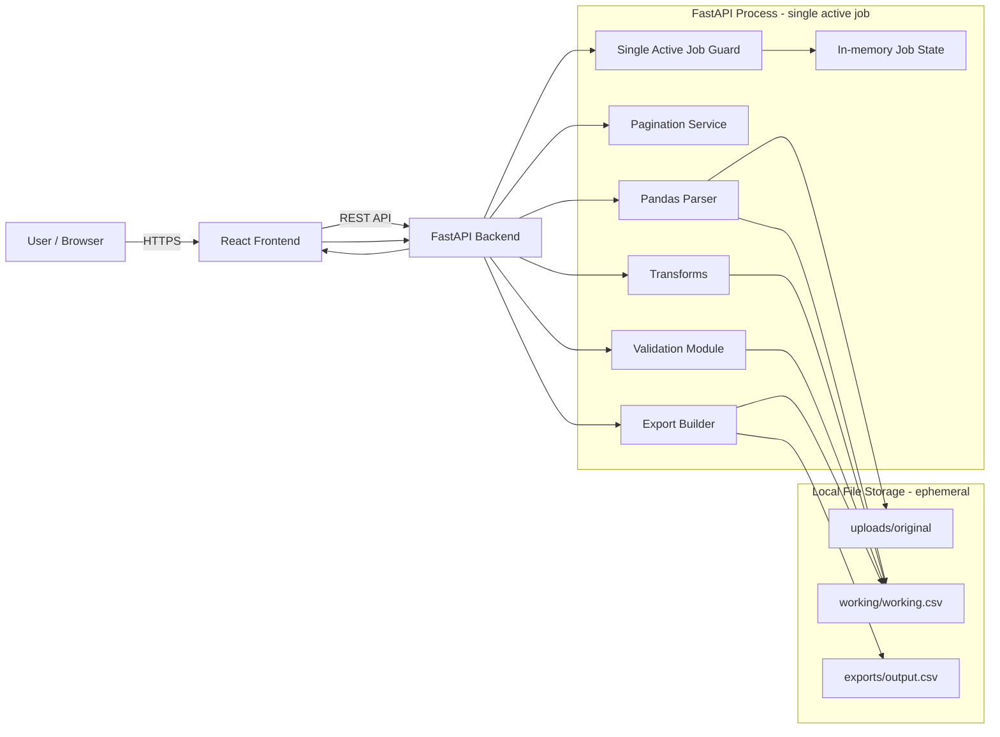
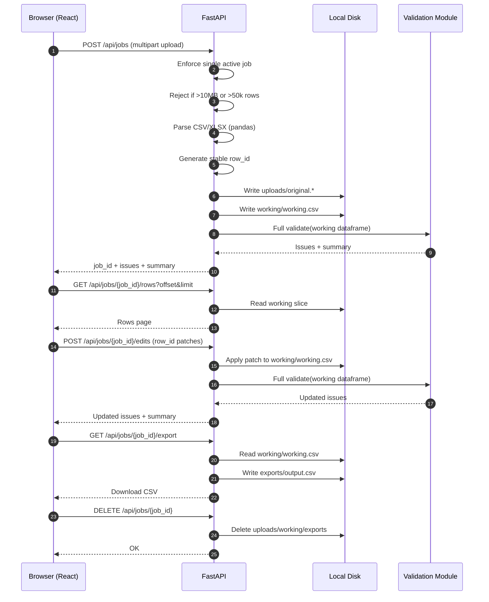

# Databuddy HR — Architecture (MVP)

This document describes the **high-level architecture** of Databuddy HR (MVP), aligned with the finalized technical decisions:

- **React** frontend served separately from the API
- **FastAPI** backend using **Pandas** for parsing/transforms
- **Validation module** is a pure Python library (no DB/files)
- **Local disk storage** only (ephemeral)
- **Single active job** enforced
- **Offset/limit pagination** for dataset retrieval
- **Stable `row_id` generated on ingest**
- **Immediate patch application** to the working dataset
- **Full revalidation** after upload/edits/bulk actions
- **Synchronous export**
- Hard limits: **50,000 rows** and **10 MB** per upload (reject immediately)

> Note on persistence: **No Postgres in MVP.** All state is ephemeral and disappears when the API process stops.

---

## 1) Component Diagram (High-Level)

---

## 2) Responsibilities by Layer

### React Frontend
- Upload file and display schema/validation results
- Render an editable grid fed by **paged row data**
- Submit **patch-style** cell edits and bulk actions
- Fetch updated validation summaries and issues
- Download the corrected export

### FastAPI Backend
- Enforce **single active job** (reject new uploads when a job is active)
- Validate upload constraints (type, **10 MB**, **50k rows**) before processing
- Parse CSV/XLSX via Pandas
- Generate stable `row_id` on ingest
- Persist original + working datasets to local disk
- Apply edits/bulk actions immediately to the working dataset
- Run **full validation** after each change
- Serve paginated rows for grid display
- Generate export synchronously

### Validation Module
- Pure Python rules engine
- Accepts a dataframe (or equivalent in-memory representation) + schema rules
- Returns a list of issues (errors/warnings) with `row_id` and optional column
- Does not touch:
  - disk/file paths
  - FastAPI request/response objects
  - any database

### Local File Storage (Ephemeral)
- Contains only the current job’s artifacts; wiped on process stop or explicit cleanup
- Recommended directory layout:
  - `storage/uploads/original.csv|xlsx`
  - `storage/working/working.csv`
  - `storage/exports/output.csv`

---

## 3) Data Flow (Request-Level)

---

## 4) API Shape (MVP)

- `POST /api/jobs`
  - Upload file; creates the single active job
  - Returns `job_id`, validation summary, and issues

- `GET /api/jobs/{job_id}`
  - Returns metadata + validation summary + issues

- `GET /api/jobs/{job_id}/rows?offset=&limit=`
  - Returns a page of rows for the grid
  - **Order guarantee:** stable by original file order (no user-driven sorting in MVP)

- `POST /api/jobs/{job_id}/edits`
  - List of `{ row_id, column, value }`
  - Applies immediately to working dataset; full revalidation

- `POST /api/jobs/{job_id}/bulk`
  - Bulk action definition (replace/trim/case/map)
  - Applies to working dataset; full revalidation

- `GET /api/jobs/{job_id}/export`
  - Synchronously returns corrected CSV export

- `DELETE /api/jobs/{job_id}`
  - Cleans up local disk artifacts and clears active job

---

## 5) Constraints, Guarantees, and Failure Modes

### Hard constraints
- Reject uploads over **10 MB**
- Reject datasets over **50,000 rows**
- Single active job enforced (reject concurrent jobs)

### Guarantees
- Stable `row_id` per ingested row
- Deterministic validation results and export
- Deterministic pagination order (original file order)

### Expected failure modes
- Process restart: all job state and files are lost (by design)
- Invalid file type/structure: immediate error
- Limit violations: immediate error with reason and limit values

---

## 6) Future Extension (Non-MVP)

If/when persistence and multi-user support are required, introduce **Postgres** for:
- Job metadata and lifecycle state
- Issues indexing and history
- Transformation logs/audit
- Tenant/user scoping

This is intentionally excluded from MVP to preserve the ephemeral, single-user operating model.
